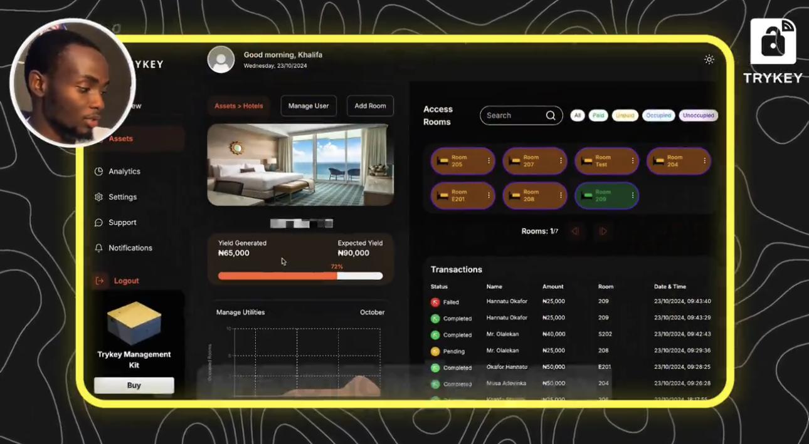
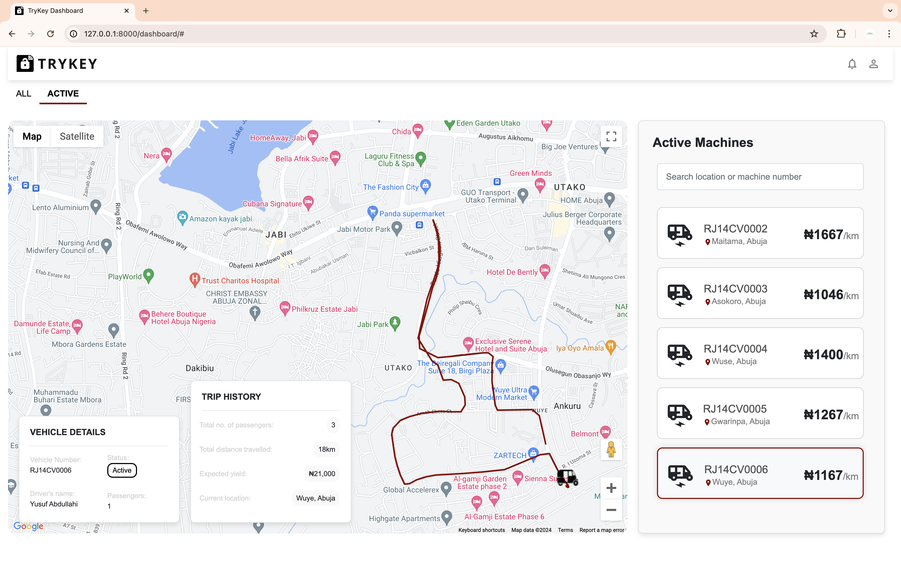

## Asset Management System — Physical Asset Lifecycle, Telemetry & Revenue Backend 🚀



*A practical, operations-first backend for tracking physical units, their lifecycle, their event history, and the business metrics they drive.* 📊

Asset Management System is a Django REST backend that models **real-world physical assets** (e.g., a hotel and its rooms, or a fleet and its vehicles) as software objects with:

- **Stable IDs** you can put on a physical label (print as a QR/barcode using any generator)
- **A lifecycle** (inactive → active → expired) that can be **automated**
- **An event history** sourced from devices/edge systems (MQTT telemetry)
- **A monetization loop** (Paystack payments update revenue, unlock access, then auto-expire)
- **Operational controls** (send “lock/unlock”, “ignition on/off”, etc. via MQTT)

The result is a practical reference system for building digital histories for individual “units” (a room, a vehicle, or any other uniquely-identifiable physical item).

---

## What this project is built for 🎯

Many businesses manage physical units that have to be:

- identified unambiguously
- monitored in near-real time
- activated/deactivated based on policy (time, payment, authorization)
- audited (who did what, when, and to which physical unit)
- measured for performance (revenue, utilization, yield)

This backend demonstrates those primitives end-to-end, using **Hotels/Rooms** and **Fleets/Vehicles** as concrete asset types.

---

## Key features (solution-first) ✨

- **Physical asset mapping (unit-level tracking)**  
  - `Asset` represents a top-level “container” (a hotel or a fleet) with a generated `asset_number`.
  - `HotelRoom` and `Vehicle` represent **individual physical units** under that asset.

- **Lifecycle + automation**  
  - When a payment is verified, the system **activates the sub-asset** and sets an expiry timestamp.
  - Celery schedules an expiry job that can **re-lock / disable** access when time is up.

- **Event history (append-only audit trail)**  
  - `AssetEvent` records telemetry and control actions against a specific sub-asset via a `GenericForeignKey`.
  - MQTT topics are structured so every message cleanly maps to: asset → unit → event type.

- **Remote control plane (HTTP → MQTT)**  
  - Authenticated API calls publish MQTT commands like:
    - Room: electricity / access (lock/unlock)
    - Vehicle: ignition (turn_on/turn_off)
  - Each command is also written to `AssetEvent` for auditability.

- **Payments & revenue accounting (Nigeria-ready rails)**  
  - Paystack card payment initialization + verification.
  - Transfer initiation scaffolding and webhook signature verification (HMAC-SHA512).
  - All revenue aggregates per asset (`Asset.total_revenue`) and powers analytics.

- **Analytics you can act on**  
  - “Index” stats: total assets, total revenue, daily revenue graph by asset type.
  - “Status” stats: occupancy/utilization and expected yield from events.

---

## Architecture at a glance

### System architecture (illustrative)

```text
                          ┌───────────────────────────────┐
                          │           Clients             │
                          │  Web / Mobile / Admin tools   │
                          └───────────────┬───────────────┘
                                          │ HTTPS (JWT)
                                          v
┌───────────────────────┐     ┌───────────────────────────────┐
│   Payment Provider     │<--->│        Django REST API         │
│ (Paystack/Flutterwave) │     │  core + assets + analytics +   │
└───────────────────────┘     │         mqtt_handler            │
                              └───────┬───────────┬────────────┘
                                      │           │
                                      │           │ publish control commands
                                      │           v
                                      │   ┌───────────────────────────┐
                                      │   │         MQTT Broker        │
                                      │   │ (topics encode unit IDs)   │
                                      │   └───────────┬───────────────┘
                                      │               │ telemetry + state
                                      │               v
                                      │   ┌───────────────────────────┐
                                      │   │     Edge/IoT Devices       │
                                      │   │ locks, sensors, trackers   │
                                      │   └───────────────────────────┘
                                      │
                                      │ persist domain state + event log
                                      v
                            ┌───────────────────────────────┐
                            │          PostgreSQL            │
                            │ Assets / Sub-assets / Events   │
                            │ Roles / Transactions / Metrics │
                            └───────────────────────────────┘

                              async jobs (expiry, automation)
                              ┌───────────────────────────────┐
                              │          Celery Worker         │
                              └───────────────┬───────────────┘
                                              │ broker/result backend
                                              v
                                        ┌───────────┐
                                        │   Redis   │
                                        └───────────┘
```

**How to read this diagram**

- **Telemetry (device → system)**: Devices publish MQTT telemetry (e.g., occupancy, location). The subscriber writes `AssetEvent` rows (and may update the sub-asset state, e.g., vehicle location).
- **Control (system → device)**: Authorized users call HTTP endpoints. The API publishes MQTT commands (retain=true) and also logs the action as an `AssetEvent`.
- **Lifecycle automation**: Payments (and direct controls) can schedule Celery tasks that enforce expiry policies (e.g., re-lock / disable after a time window).
- **Business visibility**: Analytics reads from the same source of truth—transactions + events—to compute revenue graphs and utilization/yield-style indicators.

### High-level data model

- **Asset** (`core.models.Asset`)  
  A hotel or fleet with an `asset_number`, location, bank details, and `total_revenue`.

- **HotelRoom / Vehicle** (`core.models.HotelRoom`, `core.models.Vehicle`)  
  Sub-assets with status + activation/expiry timestamps. Vehicles track location + total distance.

- **AssetEvent** (`core.models.AssetEvent`)  
  Event log attached to either a room or a vehicle (via `GenericForeignKey`).

- **Role** (`core.models.Role`)  
  Role-based access per asset: admin / manager / viewer.

- **Transaction** (`core.models.Transaction`)  
  Payment records, linked to an asset and a sub-asset number.

### App layout

- **`core/`**: authentication, payments (init/verify), core models, and shared helpers
- **`assets/`**: asset/sub-asset CRUD, role association (“invite/kick”), transaction history
- **`mqtt_handler/`**: control endpoints (publish MQTT), status endpoints, and MQTT subscriber bootstrap
- **`analytics/`**: dashboard-style aggregated metrics
- **`rooms/`, `vehicles/`**: additional endpoints (older/alternate API style); data models still live in `core.models`

### Eventing flow

- **Device/edge publishes telemetry** → MQTT broker  
  Example topic pattern:
  - `rooms/{asset_number}/{room_number}/occupancy`
  - `vehicles/{asset_number}/{vehicle_number}/location`

- **Subscriber ingests** → `AssetEvent` (+ optional location update)  
  MQTT subscriber is started in `mqtt_handler.apps.MqttHandlerConfig.ready()` (disabled during tests).

### Control flow

- **Client calls API** → publishes MQTT command (retain=true) → logs `AssetEvent`  
  Control endpoints validate:
  - the asset exists
  - the unit exists under that asset
  - the user has permission (admin or system user)

---

## API overview (practical)

All API routes are mounted under `'/api/'` (see `hotel_demo/urls.py`).

### Authentication

- `POST /api/auth/register/`
- `POST /api/token/` (JWT)
- `POST /api/token/refresh/`
- `GET /api/auth/me/`

### Asset CRUD (asset-number centric)

- `GET /api/assets/`
- `POST /api/assets/`
- `GET /api/assets/{asset_number}/`
- `PATCH /api/assets/{asset_number}/`
- `DELETE /api/assets/{asset_number}/`

### Sub-assets under an asset

- **Rooms**
  - `GET /api/assets/{asset_number}/rooms/`
  - `POST /api/assets/{asset_number}/rooms/`
  - `GET /api/assets/{asset_number}/rooms/{room_number}/`

- **Vehicles**
  - `GET /api/assets/{asset_number}/vehicles/`
  - `POST /api/assets/{asset_number}/vehicles/`
  - `GET /api/assets/{asset_number}/vehicles/{vehicle_number}/`

### Role association

- `GET /api/assets/{asset_number}/users/`
- `POST /api/assets/invite/{asset_number}/` (assign role by email)
- `POST /api/assets/kick/{asset_number}/` (remove role by email)

### Payments (Paystack)

- `POST /api/payment/init/`  
  Creates a pending `Transaction` and returns a Paystack checkout link.

- `GET /api/payment/verify/?trxref={transaction_ref}`  
  Verifies with Paystack, then:
  - marks transaction verified
  - updates asset revenue
  - activates the sub-asset and schedules expiry via Celery

### Control + status (HTTP → MQTT)

- `POST /api/assets/{asset_number}/control/{sub_asset_id}/`
- `POST /api/assets/{asset_number}/direct_control/{sub_asset_id}/`
- `GET /api/assets/{asset_number}/status/`
- `GET /api/assets/{asset_number}/status/{sub_asset_id}/`

### Analytics

- `GET /api/analytics/index/?year=YYYY&month=MM`

### Additional endpoints (alternate style)

- `GET|POST /api/vehicles/`
- `GET|PUT|DELETE /api/vehicles/{id}/`
- `GET /api/vehicles/{id}/status/`
- `GET|POST /api/hotels/{hotel_id}/rooms/`
- `GET|PUT|DELETE /api/hotels/rooms/{id}/`

---

## MQTT topic contract (lowest-jargon, highest-precision)

The system expects MQTT messages whose **topic encodes identity**:

- **Rooms**
  - `rooms/{asset_number}/{room_number}/occupancy` (payload like `1` or `0`)
  - `rooms/{asset_number}/{room_number}/electricity` (payload is arbitrary command/state)
  - `rooms/{asset_number}/{room_number}/access` (payload like `lock` / `unlock`)

- **Vehicles**
  - `vehicles/{asset_number}/{vehicle_number}/location` (payload: `"lat,lon"`)
  - `vehicles/{asset_number}/{vehicle_number}/ignition` (payload like `turn_on` / `turn_off`)
  - `vehicles/{asset_number}/{vehicle_number}/passenger_count`
  - `vehicles/{asset_number}/{vehicle_number}/tampering`
  - `vehicles/{asset_number}/{vehicle_number}/payment`

Notes:
- Location payloads are validated (lat/lon range, and `0,0` is rejected).
- Each received message becomes an `AssetEvent`. For location, the `Vehicle` object is also updated.

---

## Analytics & ROI-style insights

This codebase treats analytics as a first-class feature rather than a “report later” afterthought:

- **Revenue is computed and stored** (`Asset.total_revenue`) and can be re-aggregated.
- **Daily revenue graph** is computed from `Transaction` history (grouped by date and asset type).
- **Operational yield indicators** are derived from event streams:
  - For hotels: occupancy events → expected yield (sum of room prices for occupied rooms).
  - For vehicles: per-day activity inferred from events (vehicles with events, active vehicles, etc.).

---

## Dashboard preview (example consumer UI)

The backend is API-first, but it’s designed to power a practical operations dashboard—asset overview, unit status/control, and transaction audit in one place.

**Hotel operations dashboard**


**Vehicle operations dashboard**



---

## Configuration

### `conf.yml`

Centralized “business constants” live in `conf.yml`, including:

- roles and payment statuses
- supported asset types and event types
- transfer policy (min/max amounts, charge bands, confirmation expiry window)
- frontend redirect URL + transaction reference prefix

### Environment variables

Required (or effectively required) in `hotel_demo/settings.py`:

- **Core**
  - `SECRET_KEY`
  - `DEBUG` (`true` / `false`)
  - `SYSTEM_USER_REQUEST_DOMAIN` (defaults to `localhost:8000`)

- **Database (PostgreSQL)**
  - `DB_NAME`, `DB_USER`, `DB_PASSWORD`, `DB_HOST`, `DB_PORT`

- **Redis / Celery**
  - `REDIS_URL` (defaults to `redis://localhost:6379/0`)

- **Payments**
  - `PAYSTACK_SECRET_KEY_DEV`, `PAYSTACK_SECRET_KEY_LIVE`
  - `FLW_PUBLIC_KEY`, `FLW_SECRET_KEY`, `FLW_SECRET_HASH` (Flutterwave helpers exist)

---

## Local development (technical details)

### Requirements

- Python 3.x
- PostgreSQL
- Redis (for Celery broker/results)

### Install dependencies

```bash
pip install -r requirements.txt
```

### Database migrations

```bash
python manage.py migrate
```

### Create an admin user

```bash
python manage.py createsuperuser
```

### Background workers (Celery)

In separate terminals:

```bash
celery -A hotel_demo worker -l info
```

If you use scheduled tasks (celery beat):

```bash
celery -A hotel_demo beat -l info
```

### MQTT subscriber

The MQTT subscriber thread is started automatically when `mqtt_handler` is installed (via `AppConfig.ready()`).

In tests, the app is removed from `INSTALLED_APPS` to prevent background threads during test execution.

---

## How the lifecycle works (payment → access → expiry)

### Hotel room activation

1. `POST /api/payment/init/` creates a pending `Transaction` for a specific `asset_number` + `room_number`.
2. `GET /api/payment/verify/` verifies the transaction and:
   - marks it `completed`
   - increments `Asset.total_revenue`
   - sets `HotelRoom.status = True`
   - sets/extends `HotelRoom.expiry_timestamp`
   - publishes an access command (unlock)
   - schedules expiry to re-lock and deactivate

### Vehicle activation

Same pattern as hotel rooms, except the control domain is “ignition” rather than “access”.

---

## Security model

- **JWT authentication** for core API access.
- **Role-based access** enforced per asset (`Role` model).
- **Paystack webhook signature verification** uses HMAC-SHA512 over the raw request body.

---

## Known gaps / notes (transparent)

- **QR code generation is not implemented inside this repo**, but all identifiers (`asset_number`, `room_number`, `vehicle_number`) are label-friendly and can be encoded into QR/barcodes externally.
- Some payment/transfer flows are still evolving (e.g., `FinalizeTransferView` is a stub).
- MQTT broker defaults to a public broker (`broker.emqx.io`) for demonstration; production should use a private broker + authentication + TLS.

---

## License

This project is shared **for showcasing and evaluation**. See `LICENSE`.

